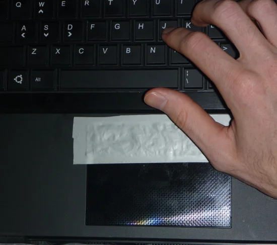

# unpalm

A Linux palm rejection filter for touchpads, written in Rust.

## Problem

Many Linux touchpad drivers don't provide adequate palm rejection, causing accidental touches when typing or resting your palms on the touchpad edges. This tool addresses that by filtering out touches that begin in configurable exclusion zones.

### The Hardware Workaround This Replaces



*Photo credit: [Lattice Point](http://www.latticepoint.org/blog/2014-9-8how-to-block-the-use-of-part-of-a-touchpad)*

Some users resort to applying duct tape and aluminum foil to physically block portions of their touchpad (conductive material is required since regular tape won't prevent capacitive touch sensors from detecting input). **unpalm provides the same functionality in software** - defining exclusion zones without the need for physical modifications.

## Why unpalm?

Existing solutions have significant limitations:

- **libinput's palm detection** requires hardware support and isn't configurable - you either get the automatic detection or nothing
- **xinput/Synaptics tools** are X11-only and don't work on Wayland, which is becoming the standard
- **Windows has Touchpad Blocker, macOS has BetterTouchTool** - but Linux lacked a comparable cross-platform solution
- **Driver-specific settings** (Synaptics, ELAN) vary by hardware and aren't portable across machines

unpalm solves these problems by working at the evdev level, making it compatible with any display server, any compositor, and any touchpad hardware.

## Features

- **Works everywhere** - Compatible with X11, Wayland, and any compositor (sway, Hyprland, GNOME, KDE, etc.)
- **Truly configurable** - Unlike libinput's automatic-only approach, customize margins and exclusion zones to your needs
- **Custom polygon zones** - Unique capability to define arbitrary shapes (perfect for corner triangles or complex layouts)
- **Smart per-touch tracking** - Only blocks touches that start in exclusion zones, not those that move into them
- **Hardware independent** - Works with any touchpad via evdev, no driver-specific dependencies
- **Lightweight** - Single ~300KB binary with no runtime dependencies
- **Systemd integration** - Run as a system service for automatic palm rejection on boot

## Comparison with Alternatives

| Feature | unpalm | libinput palm detection | xinput/Synaptics | Touchpad Blocker (Windows) | BetterTouchTool (macOS) |
|---------|----------------|------------------------|------------------|----------------------------|------------------------|
| **Wayland support** | ✅ Yes | ✅ Yes | ❌ No (X11 only) | N/A | N/A |
| **X11 support** | ✅ Yes | ✅ Yes | ✅ Yes | N/A | N/A |
| **Configurable zones** | ✅ Margins + polygons | ❌ Automatic only | ⚠️ Limited | ✅ Yes | ✅ Yes |
| **Custom polygon zones** | ✅ Yes | ❌ No | ❌ No | ❌ No | ⚠️ Limited |
| **Hardware independent** | ✅ Any evdev device | ⚠️ Needs HW support | ❌ Driver-specific | ✅ Yes | ✅ Yes |
| **Per-touch tracking** | ✅ Yes | ✅ Yes | ❌ No (coord-based) | ⚠️ Varies | ⚠️ Varies |
| **Runtime dependencies** | ❌ None | ⚠️ libinput | ⚠️ X11 + drivers | ⚠️ .NET Framework | ⚠️ macOS 10.10+ |
| **Binary size** | ~300KB | Part of libinput | N/A | ~2MB | ~15MB |

**Key differentiators:**
- unpalm is the only Linux solution that combines Wayland support, configurable polygon zones, and hardware independence
- Unlike libinput, you have full control over exclusion zones instead of relying on automatic detection
- Unlike xinput-based tools, it works on modern Wayland compositors (sway, Hyprland, etc.)

## Requirements

- Linux with evdev support
- Rust toolchain (for building)
- Root privileges (to grab input devices)

## Quick Start

Build the project:

```bash
cargo build --release
```

Run with default settings (20% margins on left, right, and top):

```bash
sudo ./target/release/unpalm
```

The tool will auto-detect your touchpad and create a filtered virtual device.

## CLI Options

| Option | Description | Default |
|--------|-------------|---------|
| `-n, --device-name <PATTERN>` | Device name pattern with wildcard support (e.g., `*ELAN*4448`) | Auto-detect |
| `-f, --device-file <PATH>` | Device file path (e.g., `/dev/input/event5`) | Auto-detect |
| `--margin-left <PERCENT>` | Left margin as percentage of touchpad width | 20 |
| `--margin-right <PERCENT>` | Right margin as percentage of touchpad width | 20 |
| `--margin-top <PERCENT>` | Top margin as percentage of touchpad height | 20 |
| `--margin-bottom <PERCENT>` | Bottom margin as percentage of touchpad height | 0 |
| `--polygon <POINTS>` | Polygon exclusion zone (format: `"x1,y1 x2,y2 x3,y3"` where x,y are percentages 0-100) | None |

**Note:** All polygon coordinates are specified as percentages (0-100) of the touchpad's width/height, making configurations portable across different touchpad sizes.

## Usage Examples

**Auto-detect touchpad with default margins:**
```bash
sudo ./target/release/unpalm
```

**Specify touchpad by name pattern:**
```bash
sudo ./target/release/unpalm -n "*Synaptics*"
```

**Custom margins (30% left/right, 15% top, 10% bottom):**
```bash
sudo ./target/release/unpalm --margin-left 30 --margin-right 30 --margin-top 15 --margin-bottom 10
```

**No margins, only a custom triangular exclusion zone:**
```bash
# Triangle at top-left corner (coordinates are percentages: 0-100)
sudo ./target/release/unpalm --margin-left 0 --margin-right 0 --margin-top 0 \
  --polygon "0,0 20,0 10,30"
```

**Multiple polygon zones:**
```bash
# Two triangles at top corners (all coordinates are percentages 0-100)
sudo ./target/release/unpalm \
  --polygon "0,0 15,0 0,25" \
  --polygon "85,0 100,0 100,25"
```

**Specify exact device file:**
```bash
sudo ./target/release/unpalm -f /dev/input/event5
```

## Service Installation

For automatic palm rejection on boot, install as a systemd service. See [INSTALL.md](INSTALL.md) for detailed instructions.

## How It Works

1. The tool grabs the physical touchpad device (making it unavailable to other applications)
2. Creates a virtual touchpad device with identical capabilities
3. Monitors all touch events from the physical device
4. Blocks individual touches that start within exclusion zones
5. Forwards all other events to the virtual device
6. Applications interact with the filtered virtual device instead

Touches are tracked per-slot, so if you start a touch in an allowed area, it continues to work even if you move into an exclusion zone. This provides natural palm rejection without interfering with normal touchpad use.

## Similar Projects

For transparency and completeness, here are related projects and approaches:

**Linux:**
- [libinput palm detection](https://wayland.freedesktop.org/libinput/doc/latest/palm-detection.html) - Built-in automatic palm detection (requires hardware support)
- [touchpadtuner](https://github.com/robertu94/touchpadtuner) - GUI for configuring xinput touchpad settings (X11 only)

**Other platforms:**
- [Touchpad Blocker](https://touchpad-blocker.com/) - Palm rejection for Windows
- [BetterTouchTool](https://folivora.ai/) - Comprehensive macOS gesture and input customization tool

**Why unpalm exists:** None of the Linux solutions above offer configurable, polygon-based exclusion zones that work on both X11 and Wayland without hardware dependencies.

## Development Note

This project was vibe-coded to quickly solve a specific problem: the ASUS Zenbook Duo keyboard's palm rejection doesn't work in detached mode, making it nearly unusable. I needed a solution immediately, so this was built fast and pragmatically. It works well, but the code will be cleaned up later. Don't expect enterprise-grade architecture or exhaustive edge case handling right now.

## Related Files

- [INSTALL.md](INSTALL.md) - Detailed installation and systemd service setup
